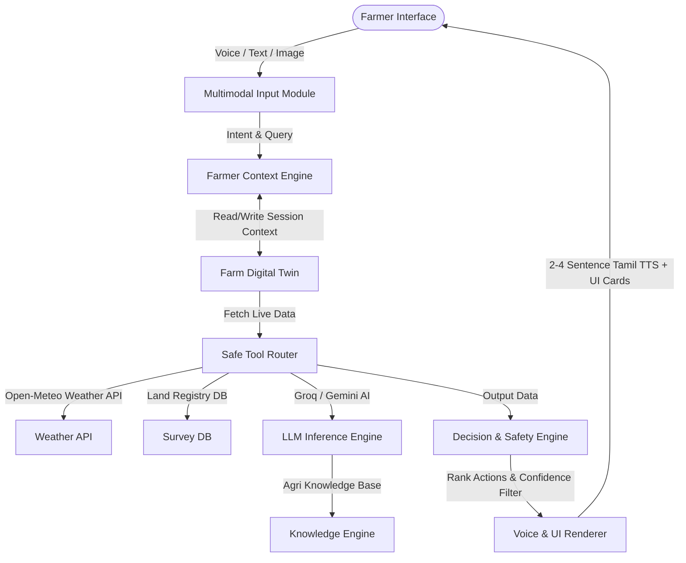

# AI Farm Copilot: Architecture Design Specification

This document outlines the software architecture, data schemas, and execution pipelines for the **AI Farm Copilot** (AI Farm Decision Assistant) integrated into the agriculture platform.

---

## 1. System Architecture

The AI Farm Copilot acts as an intelligence layer over the existing platform. The system flows from multimodal user inputs to contextualized decision outputs:



---

## 2. Farmer Context Engine & Digital Twin Schema

The copilot builds a dynamic state of the farmer's land called the **Farm Digital Twin**. This context is stored in `localStorage` under `"farm_digital_twin"` to ensure persistence across page navigations without requiring database updates.

### Data Schema:
```json
{
  "farmer": {
    "uid": "user_firebase_uid_123",
    "name": "Arumugam",
    "village": "Melur",
    "district": "Madurai",
    "phone": "9876543210"
  },
  "activeFarm": {
    "surveyNo": "104/2B",
    "pattaNo": "512",
    "village": "Melur",
    "acres": 2.4,
    "classification": "Wetland (நன்செய்)",
    "soilType": "clay",
    "crop": "Paddy (Rice)",
    "variety": "Ponni",
    "sowingDate": "2026-06-15",
    "cropAgeDays": 55,
    "cropStage": "Vegetative / Tillering",
    "irrigationMethod": "Flood Irrigation"
  },
  "conditions": {
    "weather": {
      "temp": 28.5,
      "humidity": 82,
      "windSpeed": 12.4,
      "precipitationSum": 0.0,
      "forecast3Days": "Rain expected on day 2"
    },
    "pestRisk": "MEDIUM",
    "diseaseRisk": "LOW"
  },
  "history": {
    "lastIrrigated": "2026-08-07T08:00:00Z",
    "lastFertilized": "2026-07-20T10:00:00Z",
    "previousIssues": ["Blast Spots observed in July"]
  }
}
```

---

## 3. Multimodal Voice Engine

* **Speech-to-Text (STT)**: Utilizes the browser's native **Web Speech Recognition API** (`webkitSpeechRecognition`).
  * **Mixed Language Recognition**: Listens in Tamil (`ta-IN`) with fallbacks to English (`en-US`).
  * **Tamil + English speech mapping**: Translates common Tanglish commands (e.g. *"Weather epdi iruku"*, *"Survey map open pannu"*) to standard intent values.
* **Text-to-Speech (TTS)**: Utilizes the browser's native **Web Speech Synthesis API** (`SpeechSynthesisUtterance`).
  * **Tamil Accent Tuning**: Configures `rate = 0.85` (medium-slow), `pitch = 1.0`, and dynamically selects `ta-IN` localized voices.
  * **Speech Interruption**: Binds window-level key/click triggers to `window.speechSynthesis.cancel()` so farmers can immediately interrupt speech replies by clicking any button or tapping the microphone.
  * **Response Limit**: Voice replies are formatted to be 2-4 short sentences in length. Detailed cards (valuation lists, weather trend metrics) are rendered on the screen.

---

## 4. Intent & Safe Tool-Call Router

The Copilot evaluates the user query and routes it to specific tools. **LLM tool calls must be strictly validated before execution**:

| Tool Name | Parameters | Target Action / Data Source |
| :--- | :--- | :--- |
| `getFarmContext()` | None | Reads local active Farm Digital Twin state. |
| `getWeather()` | `lat, lon` | Queries Open-Meteo current conditions. |
| `getForecast()` | `lat, lon` | Queries Open-Meteo 7-day precipitation lists. |
| `getMarketPrice()` | `crop, location` | Reads market db / fetches local mandi prices. |
| `getSurveyData()` | `surveyNo, village` | Fetches simulated secure cadastral database records. |
| `navigateToPage()`| `pageUrl, hash` | Updates window location (e.g., `survey.html#weather`). |
| `createFarmTask()`| `taskName, priority`| Appends a task to the local budget/farm calendar database. |

---

## 5. Decision & Safety Engine (Confidence Filters)

Every action generated by the Copilot is passed through a validation filter:

```
                  +-----------------------------------+
                  |      Generate Recommendation      |
                  +-----------------------------------+
                                    |
                                    v
                  +-----------------------------------+
                  |     Calculate Confidence Score    |
                  |     Based on data completeness    |
                  +-----------------------------------+
                                    |
                    +---------------+---------------+
                    |               |               |
                    v               v               v
                [ HIGH ]        [ MEDIUM ]       [ LOW ]
              (Score >= 80)    (50 <= S < 80)  (Score < 50)
                    |               |               |
                    v               v               v
             Execute Action/   Explain Caveats/   Request More
              Render Advice     Show Outdated     Details from
                                  Warning          Farmer
```

### Safety and Zero-Hallucination Guardrails:
1. **Fact-First Validation**: Live weather forecasts, market prices, and land registry records are never generated by AI. They must come from actual verified API calls. If the API fails, state clearly: *"இந்த தகவல் இப்போ கிடைக்கல"* (This info is currently unavailable).
2. **Rural Tamil Persona Rules**: Keep the tone soft, respectful, and friendly (e.g. *அண்ணா, நாளைக்கு மழைக்கு chance இருக்கு...*). Avoid overly technical terms.
3. **No Overconfident Assertions**: AI pest analysis must return a confidence margin (e.g. *"இது இலைச்சுருள் நோய் மாதிரி தெரியுது. உறுதி செய்ய இன்னொரு தெளிவான போட்டோ அனுப்புங்க"*).
